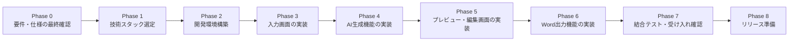

# 開発手順書（初期ドラフト）

> [requirements.md](requirements.md)・[input_items.md](input_items.md)・[output_format.md](output_format.md)・[ui_design.md](ui_design.md) の内容をもとに、実装フェーズで何をどの順番で進めるかをまとめたものです。実際に作業を始める前に、各フェーズの前提となるドキュメントの内容が固まっているか確認してください。

## 1. 開発方針

- **段階的に、小さく作る。** 最初から全機能を実装せず、[CLAUDE.md](CLAUDE.md) の方針どおりMVP（最小限で動くもの）を優先する。
- **ドキュメント→実装の順を守る。** 各フェーズの元になっているMarkdownファイルの内容が固まってから、対応する実装に着手する。仕様に迷ったら実装ではなくドキュメントを先に direct 更新する。
- **クレーム情報の取り扱いに注意する。** 個人情報・機微情報を扱うため、開発中もテストデータには実データを使わず、ダミーデータを使用する。

## 2. 開発フェーズ全体像

## 3. 各フェーズの詳細

### Phase 0：要件・仕様の最終確認

- **参照ドキュメント**：[requirements.md](requirements.md)、[input_items.md](input_items.md)、[output_format.md](output_format.md)、[ui_design.md](ui_design.md)
- **やること**
  - [requirements.md](requirements.md) 9章「未確定事項・要確認リスト」の項目を確認・決定する。
  - [output_format.md](output_format.md) 5章にある通り、実際に使っている報告書サンプルを入手し、文面構成を最終化する。
  - [input_items.md](input_items.md) 5章の検討事項（フォーム形式か自由記述かなど）を確定する。
- **完了条件**：4ファイルの「要検討」「未確定」項目のうち、実装開始に必須なものが決定済みであること。

### Phase 1：技術スタック選定

- **参照ドキュメント**：[requirements.md](requirements.md) 7章、[CLAUDE.md](CLAUDE.md)
- **やること**
  - アプリ形態（Webアプリ／デスクトップアプリ／CLIツール）を決定する。
  - フロントエンド／バックエンドの言語・フレームワークを決定する。
  - 利用する生成AI（API）を決定する（社内のセキュリティポリシーを確認のうえ）。
  - Word（.docx）生成に使うライブラリを決定する（例：`python-docx` 等）。
- **成果物**：決定した技術スタックを [CLAUDE.md](CLAUDE.md) の「技術スタック（未定）」欄に追記する。
- **完了条件**：CLAUDE.mdの技術スタック欄がすべて確定済みになっていること。
- **✅ 決定内容（2026-07-19）**：アプリ形態＝Streamlit（Python）／生成AI＝Anthropic Claude API（プロトタイプ採用、本番可否は要検討）／Word出力＝`python-docx`。詳細は [CLAUDE.md](CLAUDE.md) の「技術スタック」欄を参照。

### Phase 2：開発環境構築

- **やること**
  - リポジトリ内にソースコード用フォルダ構成を作成する。
  - 選定した言語・フレームワークのプロジェクト初期化（雛形作成）を行う。
  - 生成AI APIキーなど、秘匿情報の管理方法（環境変数、`.env` 等）を決め、`.gitignore` に反映する。
  - Lint／フォーマッタ等、最低限の開発ルールを設定する。
- **完了条件**：ローカルで「Hello World」相当の最小画面／処理が動作すること。

### Phase 3：入力画面の実装

- **参照ドキュメント**：[input_items.md](input_items.md)、[ui_design.md](ui_design.md) 3章
- **やること**
  - [ui_design.md](ui_design.md) の画面1ワイヤーフレームに沿って、入力フォームを実装する。
  - [input_items.md](input_items.md) 2章の入力形式（カレンダー、プルダウン、チェックボックス等）どおりにUI部品を実装する。
  - 必須項目のバリデーション（未入力チェック）を実装する。
- **完了条件**：全入力項目を入力し、内容が正しく保持されること（この時点ではAI生成・Word出力は未接続でよい）。

### Phase 4：AI生成機能の実装

- **参照ドキュメント**：[output_format.md](output_format.md) 2〜3章
- **やること**
  - 入力内容を生成AIに渡し、社外用・社内用の文面を生成するAPI連携処理を実装する。
  - [output_format.md](output_format.md) の構成案・文体ルールをプロンプトに反映する。
  - AI生成結果をアプリ側で受け取り、画面に表示できるようにする。
- **完了条件**：ダミー入力データから、社外用・社内用それぞれの文面が生成され、画面上で確認できること。

### Phase 5：プレビュー・編集画面の実装

- **参照ドキュメント**：[ui_design.md](ui_design.md) 4章
- **やること**
  - 生成された文面をタブ切り替え（社外用／社内用）で表示する。
  - 文面を直接編集できるテキストエリアを実装する。
  - 「再生成」ボタンの処理を実装する。
- **完了条件**：生成結果を編集し、その編集内容が次のPhase（Word出力）に正しく引き継がれること。

### Phase 6：Word出力機能の実装

- **参照ドキュメント**：[output_format.md](output_format.md) 4章、[ui_design.md](ui_design.md) 5章
- **やること**
  - 編集済みの文面を `.docx` ファイルとして生成する処理を実装する。
  - [output_format.md](output_format.md) 4章のファイル名規則・レイアウト（フォント、用紙サイズ等）を反映する。
  - 生成したファイルをダウンロードできるようにする。
- **完了条件**：実際にWordで開ける `.docx` ファイルが、社外用・社内用それぞれ正しいレイアウトで出力されること。

### Phase 7：結合テスト・受け入れ確認

- **やること**
  - 入力〜生成〜編集〜Word出力までの一連の流れを、複数パターンのダミークレームで通しテストする。
  - 必須項目未入力時のエラー表示など、異常系の動作を確認する。
  - 実際の利用者（クレーム対応担当者等）にレビューしてもらい、フィードバックを反映する。
- **完了条件**：想定利用シーン（[requirements.md](requirements.md) 4章）に沿った一連の操作が問題なく行えること。

### Phase 8：リリース準備

- **やること**
  - 利用者向けの簡単な操作手順（マニュアル）を作成する。
  - 個人情報・機微情報の取り扱いについて、最終的なセキュリティ確認を行う（[requirements.md](requirements.md) 6章）。
  - 本番環境（社内サーバー、社内PC配布等）への展開方法を決定・実施する。
- **完了条件**：実際の利用者が本番環境でアプリを使い始められる状態になっていること。

## 4. マイルストーン表（テンプレート）

| フェーズ | 目標完了日 | 担当 | ステータス |
|---|---|---|---|
| Phase 0：要件・仕様の最終確認 | 2026-07-19 | 未定 | 完了 |
| Phase 1：技術スタック選定 | 2026-07-19 | 未定 | 完了 |
| Phase 2：開発環境構築 | 未定 | 未定 | 未着手 |
| Phase 3：入力画面の実装 | 未定 | 未定 | 未着手 |
| Phase 4：AI生成機能の実装 | 未定 | 未定 | 未着手 |
| Phase 5：プレビュー・編集画面の実装 | 未定 | 未定 | 未着手 |
| Phase 6：Word出力機能の実装 | 未定 | 未定 | 未着手 |
| Phase 7：結合テスト・受け入れ確認 | 未定 | 未定 | 未着手 |
| Phase 8：リリース準備 | 未定 | 未定 | 未着手 |

> 日付・担当者が決まり次第、このテーブルを更新してください。

## 5. リスク・注意点

- 生成AIの出力は誤りや不自然な文面を含む可能性があるため、**必ず担当者が最終確認してから提出・共有する**運用を徹底する（Phase 5のプレビュー・編集画面が重要な理由）。
- クレーム内容には個人情報・機微情報が含まれる可能性があるため、開発中のテストデータ・ログ・生成AIへの送信内容に注意する。
- 技術スタック未選定のまま実装を始めると手戻りが大きいため、Phase 1を必ず先に完了させる。

## 6. 今後の検討事項

- [ ] 各フェーズの担当者・スケジュールを決定し、4章のマイルストーン表を埋める
- [ ] Phase 7の受け入れ確認をどの範囲の利用者に依頼するか決める
- [ ] リリース後の運用・保守体制（不具合対応、AIプロンプトの改善等）を誰が担うか決める
