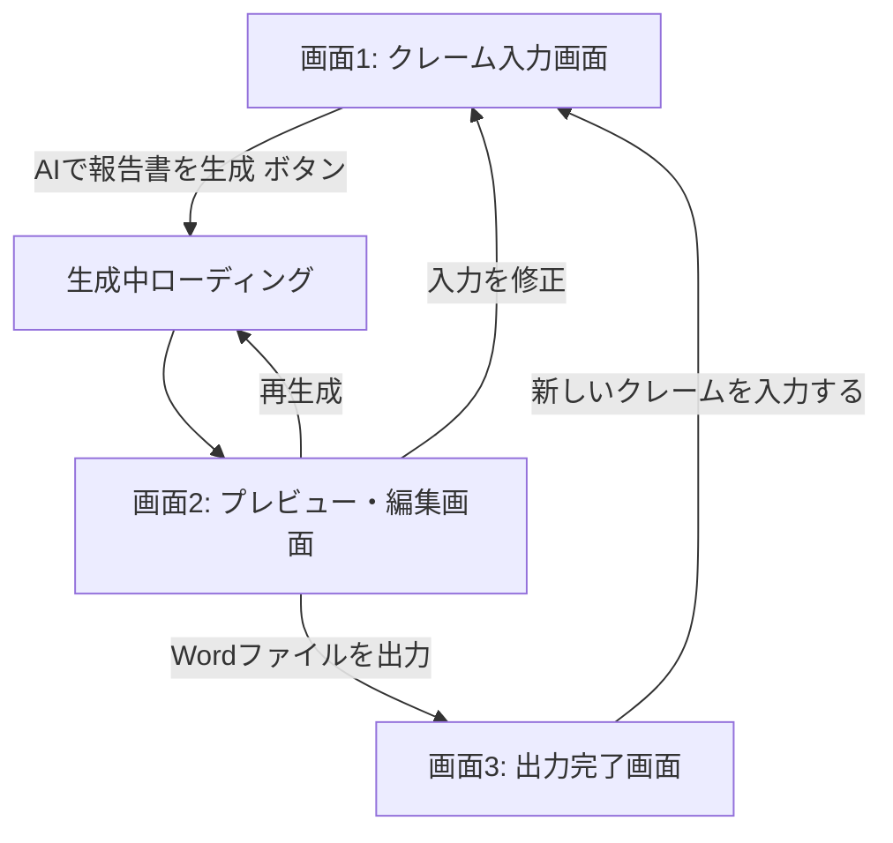

# UI設計書（初期ドラフト）

> [requirements.md](requirements.md) の利用シーン、[input_items.md](input_items.md) の入力項目・入力形式をもとにした画面設計案です。実装フェーズ（Webアプリ／デスクトップアプリ等）の技術選定に合わせて調整してください。

## 1. 前提

- 対象環境：PCブラウザでの利用を想定（[requirements.md](requirements.md) 6章）。
- 画面は「入力 → 生成結果の確認・編集 → 出力（Wordダウンロード）」の3ステップで構成する、ウィザード形式のシングルページを想定する。
- クレーム対応者がその場で完結して使えることを重視し、画面遷移は最小限にする。

## 2. 画面構成・全体フロー



| 画面 | 役割 |
|---|---|
| 画面1：クレーム入力画面 | [input_items.md](input_items.md) の項目を入力する |
| （中間状態）生成中ローディング | AIが文面を生成している間の待機表示 |
| 画面2：プレビュー・編集画面 | AIが生成した社外用／社内用の文面を確認・編集する |
| 画面3：出力完了画面 | Word（.docx）ファイルをダウンロードする |

## 3. 画面1：クレーム入力画面

### 3.1 目的
[input_items.md](input_items.md) の入力項目一覧に沿って、クレーム情報を過不足なく入力してもらう。

### 3.2 レイアウト方針
- 入力項目が多いため、セクションごとにカード／区切りを設け、上から順に入力させる。
- 「社内向け補足（任意）」セクションは初期状態で折りたたみ、必要な人だけ開いて入力する。
- 必須項目が未入力の場合は「AIで報告書を生成」ボタンを押した際にエラー表示する。

### 3.3 ワイヤーフレーム（テキストベース）

```
┌──────────────────────────────────────────────┐
│ クレーム報告書自動整形アプリ         [1 入力]─[2 確認]─[3 出力] │
├──────────────────────────────────────────────┤
│ ▼ 基本情報                                    │
│  受付日*      [📅 2026-07-12        ]         │
│  発生日       [📅 未選択  ] □ 不明・未確定     │
│  お客様名/取引先名* [                    ]    │
│  対応担当者*  [                    ]          │
│  対象商品・サービス名* [                ]     │
│                                                │
│ ▼ クレーム内容                                │
│  クレームの概要*                              │
│  [                                        ]   │
│  発生経緯*                                    │
│  [                                        ]   │
│  お客様の要望*                                │
│  □返金 □交換 □謝罪 □説明 □再発防止策の提示 □その他[   ]│
│                                                │
│ ▼ 対応状況                                    │
│  現在の対応状況* [▼ 対応中          ]         │
│  詳細                                         │
│  [                                        ]   │
│  今後の対応予定*                              │
│  [                                        ]   │
│  対応予定日   [📅 未選択（任意）]             │
│                                                │
│ ▶ 社内向け補足（任意）※クリックで展開          │
│                                                │
│ ▼ 出力設定                                    │
│  出力する報告書* ( ○社外用 ○社内用 ●両方 )    │
│  ファイル名（任意） [                    ]    │
│                                                │
│                          [ AIで報告書を生成 ▶ ]│
└──────────────────────────────────────────────┘
  * は必須項目
```

### 3.4 主なUI部品と挙動（[input_items.md](input_items.md) 2章の入力形式に対応）

| 部品 | 対応する入力項目 | 挙動メモ |
|---|---|---|
| カレンダーピッカー | 受付日、発生日、対応予定日 | 受付日はデフォルトで当日を自動セット。発生日は「不明」チェック時にピッカーを無効化 |
| 1行テキスト入力 | お客様名／取引先名、対応担当者、対象商品・サービス名、ファイル名 | 文字数上限を設定（要検討） |
| テキストエリア | クレームの概要、発生経緯、対応状況詳細、今後の対応予定、社内向け補足4項目 | 入力しやすいよう最低3行程度の高さを確保 |
| チェックボックス群 | お客様の要望、社内共有先 | 「その他」選択時のみテキスト補足欄を表示 |
| プルダウン | 現在の対応状況 | 未対応／対応中／対応済みの3択 |
| ラジオボタン | 重要度／緊急度、出力する報告書の種類 | 初期値は「中」「両方」を想定 |
| 折りたたみセクション | 社内向け補足（任意） | クリックで開閉、開閉状態は入力中保持 |

## 4. 画面2：プレビュー・編集画面

### 4.1 目的
生成AIが作成した文面を、担当者が提出・共有前に確認・微修正できるようにする。

### 4.2 レイアウト方針
- 「出力する報告書の種類」で両方選択されている場合は、社外用／社内用をタブで切り替える。
- 生成結果はそのまま編集可能なテキストエリアに表示し、AIの出力を最終文面として直接手直しできるようにする。
- 気に入らない場合は項目ごとに「再生成」できるようにする（全体再生成 または 該当セクションのみ再生成）。

### 4.3 ワイヤーフレーム（テキストベース）

```
┌──────────────────────────────────────────────┐
│ クレーム報告書自動整形アプリ         [1 入力]─[2 確認]─[3 出力] │
├──────────────────────────────────────────────┤
│  [ 社外用 ] [ 社内用 ]  ←タブ切り替え          │
│ ┌──────────────────────────────────────────┐ │
│ │ ご報告とお詫び                             │ │
│ │                                            │ │
│ │ 株式会社〇〇 御中                           │ │
│ │                                            │ │
│ │ （AIが生成した文面。編集可能なテキスト     │ │
│ │  エリアとして表示）                        │ │
│ │                                            │ │
│ └──────────────────────────────────────────┘ │
│                                    [ 🔄 再生成 ] │
│                                                │
│ [ ◀ 入力を修正する ]      [ Wordを出力する ▶ ] │
└──────────────────────────────────────────────┘
```

### 4.4 状態・挙動
- 生成中：画面全体にローディング表示（「AIが報告書を作成しています…」）。
- 生成失敗時：エラーメッセージと「再試行」ボタンを表示。
- 編集内容は自動保持し、タブを切り替えても消えないようにする。

## 5. 画面3：出力完了画面

### 5.1 目的
生成・編集済みの文面をWord（.docx）としてダウンロードさせる。

### 5.2 ワイヤーフレーム（テキストベース）

```
┌──────────────────────────────────────────────┐
│ クレーム報告書自動整形アプリ         [1 入力]─[2 確認]─[3 出力] │
├──────────────────────────────────────────────┤
│              ✅ 報告書を出力しました           │
│                                                │
│   [ ⬇ 社外用報告書.docx をダウンロード ]       │
│   [ ⬇ 社内用報告書.docx をダウンロード ]       │
│                                                │
│         [ 新しいクレームを入力する ]           │
└──────────────────────────────────────────────┘
```

出力ファイル名の命名規則は [output_format.md](output_format.md) の「4. Word（.docx）出力仕様（案）」に従う。

## 6. 共通コンポーネント・状態表示

| 項目 | 内容（ドラフト） |
|---|---|
| ヘッダー／ステップインジケーター | 現在どのステップ（入力／確認／出力）にいるかを常に表示する |
| 入力チェック・エラー表示 | 必須項目未入力時、該当項目を赤枠＋メッセージでハイライトする |
| ローディング表示 | AI生成中・Word変換中はスピナー＋メッセージを表示し、多重送信を防ぐため操作をブロックする |
| トースト／通知 | 「下書き保存しました」「出力が完了しました」等の簡易通知（下書き保存機能を実装する場合） |
| レスポンシブ対応 | まずはPCブラウザ表示を優先。将来的にタブレット対応するかは要検討 |

## 7. 今後の検討事項

- [ ] 実際の利用環境（社内システムへの組み込みか、単独Webアプリか）に応じて画面遷移・認証（ログイン）要否を確定する
- [ ] 下書き保存機能（[requirements.md](requirements.md) 5.1）を実装する場合、保存/呼び出しのUI（一覧画面など）を追加設計する
- [ ] 複数人での確認・承認フロー（[requirements.md](requirements.md) 5.4）を持たせる場合、承認者向けの画面を別途設計する
- [ ] 実際のデザイン（配色・フォント・ロゴ配置等）は、会社のデザインガイドラインがあれば参照する
- [ ] アクセシビリティ（キーボード操作、スクリーンリーダー対応）の要否を確認する
